# ProyectoTallerMecanico

<p align="center">
  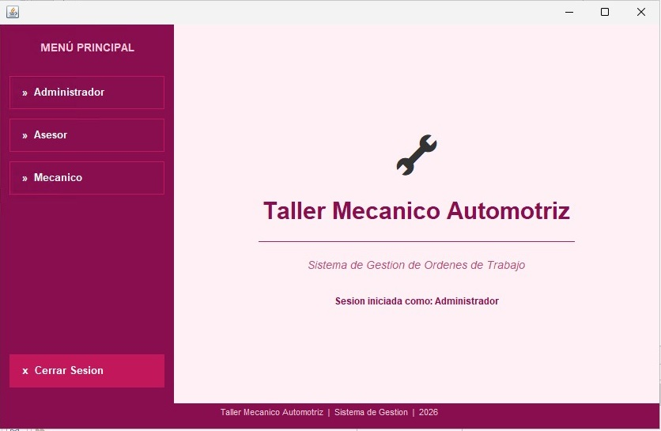
</p>

<p align="center">
  
  
  
  
  
</p>

<p align="center">
Sistema de escritorio desarrollado en Java con interfaz grafica Swing para la 
gestion integral de ordenes de trabajo y atencion de vehiculos en un taller mecanico automotriz.
</p>

> **Curso:** Programacion Orientada a Objetos
> **Periodo:** 2026-1

---

## Capturas del Sistema

### Login
<p align="center">
  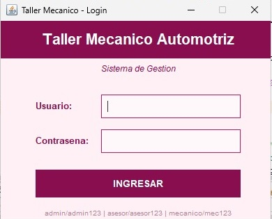
</p>

### Menu Principal
<p align="center">
  
</p>

### Gestion de Empleados y Bahias
<p align="center">
  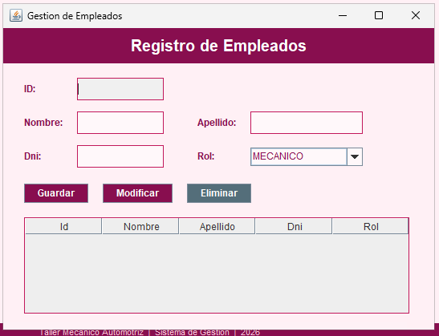
  &nbsp;
  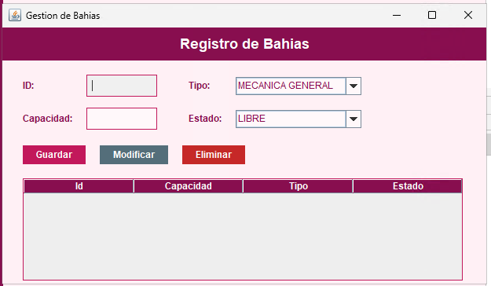
</p>

### Gestion de Servicios y Clientes
<p align="center">
  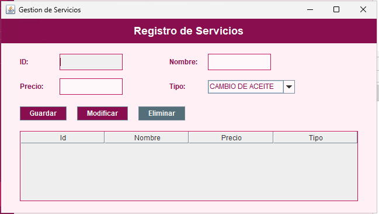
  &nbsp;
  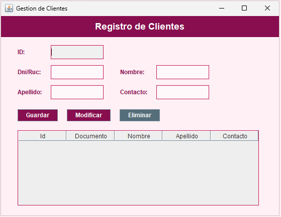
</p>

### Gestion de Vehiculos y Citas
<p align="center">
  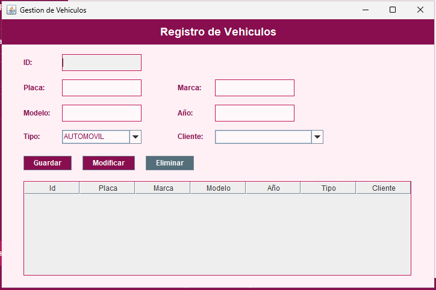
  &nbsp;
  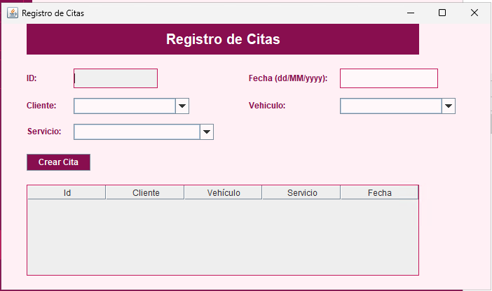
</p>

### Recepcion y Atencion
<p align="center">
  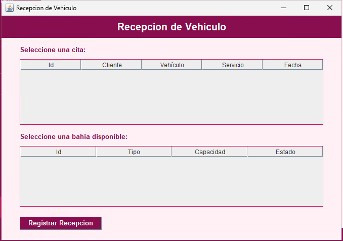
  &nbsp;
  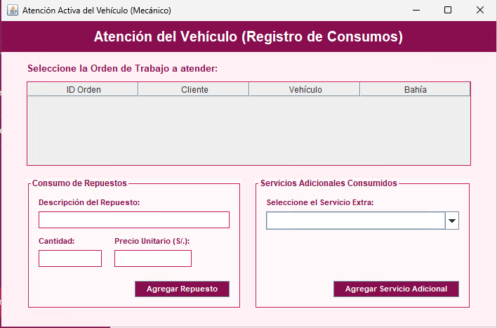
</p>

### Entrega del Vehiculo
<p align="center">
  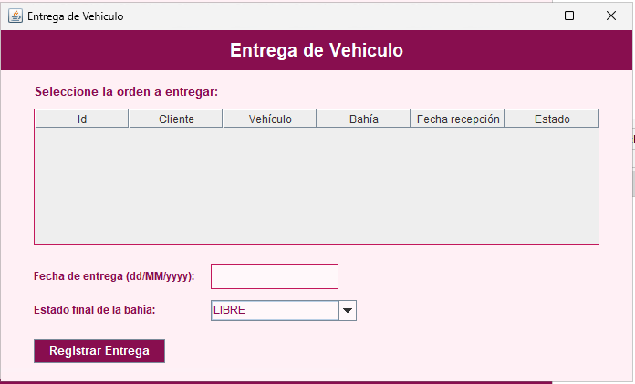
</p>

### Reportes
<p align="center">
  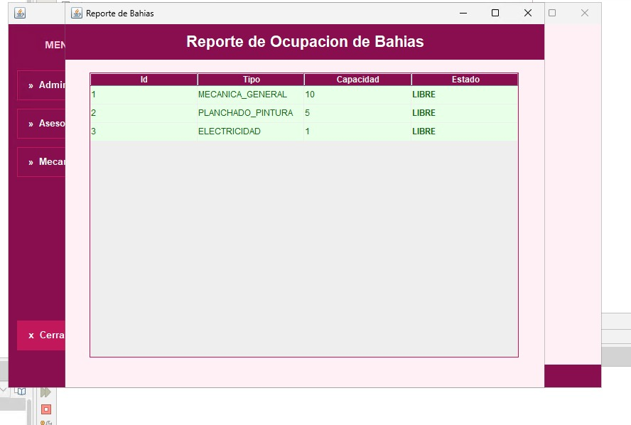
  &nbsp;
  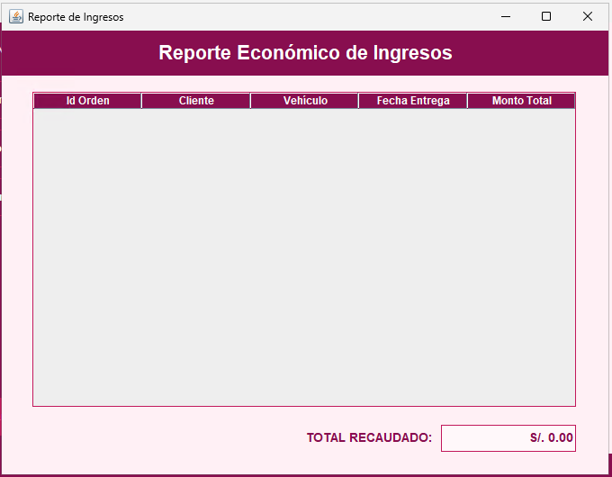
</p>


## Tabla de Contenidos

- [Descripcion](#descripcion)
- [Caracteristicas](#caracteristicas)
- [Tecnologias](#tecnologias)
- [Conceptos POO Aplicados](#conceptos-poo-aplicados)
- [Estructura del Proyecto](#estructura-del-proyecto)
- [Instalacion y Ejecucion](#instalacion-y-ejecucion)
- [Credenciales de Prueba](#credenciales-de-prueba)
- [Capturas del Sistema](#capturas-del-sistema)
- [Modulos del Sistema](#modulos-del-sistema)
- [Flujo de Trabajo](#flujo-de-trabajo)

---

## Descripcion

Sistema de gestion de taller mecanico que permite administrar empleados,
bahias de trabajo, servicios, clientes, vehiculos, citas y ordenes de trabajo.
Incluye facturacion automatica y reportes de ingresos y ocupacion de bahias.

---

## Caracteristicas

- Autenticacion con control de acceso por rol
- Gestion completa de empleados, clientes y vehiculos
- Registro y seguimiento de ordenes de trabajo
- Control de bahias de trabajo con estados en tiempo real
- Facturacion automatica al momento de entrega
- Reportes de ocupacion de bahias e ingresos por fechas
- Interfaz grafica con paleta de colores Rosa Acero
- Almacenamiento en memoria RAM sin base de datos externa

---

## Tecnologias

| Tecnologia | Version | Uso |
|------------|---------|-----|
| Java | 21 LTS | Lenguaje principal |
| Java Swing | JDK 21 | Interfaz grafica |
| Apache NetBeans | 30 | IDE de desarrollo |
| Git / GitHub | - | Control de versiones |

---

## Conceptos POO Aplicados

### Herencia


### Interfaces
- `Identificable` — implementada por las clases del modelo

### Clases Genericas
- `gestor_generico<T>` — clase base con ArrayList para CRUD

### Arreglos de Objetos
- Todos los datos se gestionan con `ArrayList` en memoria RAM
- Sin uso de base de datos externa
- Centralizados en `GestorDeMemoria.java`

### Polimorfismo
- Metodo `getRol()` en cada subclase de Empleado

---

## Estructura del Proyecto

ProyectoTallerMecanico/
└── src/
├── Gestion/                    ← logica y almacenamiento
│   ├── GestorDeMemoria.java    ← almacen central
│   ├── gestor_generico.java    ← clase generica con ArrayList
│   ├── gestor_empleados.java
│   ├── gestor_bahias.java
│   ├── gestor_servicios.java
│   ├── gestor_clientes.java
│   ├── gestor_vehiculos.java
│   ├── gestor_citas.java
│   ├── gestor_ordenes.java
│   └── Fecha.java
├── modelo/                     ← clases POO
│   ├── Identificable.java      ← interface
│   ├── Empleado.java
│   ├── Cliente.java
│   ├── Vehiculo.java
│   ├── Bahia.java
│   ├── Servicio.java
│   ├── Cita.java
│   ├── OrdenTrabajo.java
│   ├── DetalleRepuesto.java
│   └── Enums: Rol, TipoBahia, EstadoBahia...
└── gui/                        ← ventanas Swing
├── JFrameLogin.java        ← pantalla de login
├── Principal.java          ← menu principal
├── JFrameEmpleados.java
├── JFrameBahias.java
├── JFrameServicios.java
├── JFrameClientes.java
├── JFrameVehiculos.java
├── JFrameCitas.java
├── JFrameRecepcion.java
├── JFrameAtencion.java
├── JFrameEntrega.java
├── JFrameReporteBahias.java
├── JFrameReporteIngresos.java
└── EstiloUI.java

---

## Instalacion y Ejecucion

### Requisitos
- Java JDK 21 o superior
- Apache NetBeans 30

### Pasos

**1. Clonar el repositorio**
```bash
git clone https://github.com/fernanda10005/ProyectoTallerMecanico.git
```

**2. Abrir en NetBeans**
File → Open Project → seleccionar carpeta ProyectoTallerMecanico

**3. Configurar clase principal**
Click derecho en proyecto → Properties → Run
Main Class: gui.JFrameLogin

**4. Ejecutar**
---

## Credenciales de Prueba

| Rol | Usuario | Contrasena | Acceso |
|-----|---------|------------|--------|
| Administrador | admin | admin123 | Total |
| Asesor de Servicio | asesor | asesor123 | Clientes, Vehiculos, Citas, Ordenes |
| Mecanico | mecanico | mec123 | Atencion del vehiculo |

---

## Modulos del Sistema

### Login
Autenticacion por usuario y contrasena con control de acceso por rol.

### Menu Principal
Ventana principal con menu de navegacion restringido segun el rol.

### Gestion de Empleados *(Admin)*
CRUD completo de personal del taller.
Roles: Administrador, Asesor de Servicio, Mecanico.

### Gestion de Bahias *(Admin)*
Control de espacios de trabajo con estados: Libre, Ocupada, En mantenimiento.
Tipos: Mecanica General, Electricidad, Planchado y Pintura.

### Gestion de Servicios *(Admin)*
Catalogo de servicios con nombre y precio.

### Gestion de Clientes *(Asesor)*
Registro de clientes con documento y datos de contacto.

### Gestion de Vehiculos *(Asesor)*
Registro de vehiculos asociados a clientes.
Tipos: Automovil, Camioneta, Motocicleta.

### Registro de Citas *(Asesor)*
Programacion de citas con validacion de bahias disponibles.

### Recepcion *(Asesor)*
Ingreso del vehiculo asignando bahia libre.

### Atencion del Vehiculo *(Mecanico)*
Registro de servicios y repuestos durante la atencion.

### Entrega *(Asesor)*
Registro de entrega con facturacion automatica total.

### Reportes *(Admin)*
- Ocupacion de bahias con estado actual
- Ingresos por rango de fechas

---

## Flujo de Trabajo
Login con credenciales
↓
Registrar Bahias y Servicios (Admin)
↓
Registrar Cliente y Vehiculo (Asesor)
↓
Crear Cita (Asesor)
↓
Recepcion del Vehiculo (Asesor)
↓
Atencion y Consumos (Mecanico)
↓
Entrega con Facturacion (Asesor)
↓
Generar Reportes (Admin)

---

## Gestion de Memoria

El sistema utiliza `GestorDeMemoria.java` como almacen central que mantiene
todos los datos en memoria RAM durante la ejecucion mediante `ArrayList`.
No utiliza base de datos externa — cumple el requerimiento del curso de
usar arreglos de objetos en memoria.

---

<p align="center">
Proyecto academico — Programacion Orientada a Objetos 2026-1
</p>

